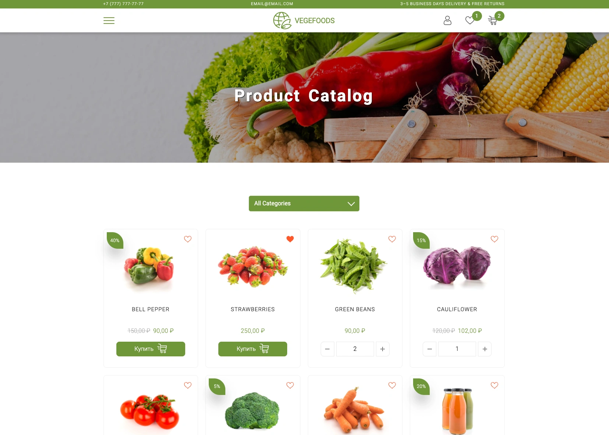

# Vegefoods

Vegefoods is an online shop for healthy foods, built with **React + Redux** on the frontend, and **Node.js + Express + MongoDB** on the backend. The app provides a full product catalog, user authentication, a shopping cart, and a REST API for managing products and orders.



**Live Demo:** [https://vegefoods-5uto.onrender.com/](https://vegefoods-5uto.onrender.com/)

> ⚠️ Note: The demo runs on a free tier service. If it has been idle, it may take up to a minute to wake up on first load.

---

## Features

- Browse product catalog of healthy foods with images, categories, and pricing
- User authentication (register, login) and profile management
- Shopping cart with Redux state (add/remove/update quantities)
- Order placement with form validation and backend persistence
- Serving React UI and API from the same server in production
- Security & performance enhancements with **helmet**, **cors**, **compression**

---

## Tech Stack

**Frontend**

- React (component‑based UI)
- Redux for state management
- SCSS for styling
- React Router for routing

**Backend**

- Node.js + Express
- MongoDB using Mongoose ODM
- JWT for authentication + password hashing (bcryptjs)
- Middleware: express‑validator, auth checks, error handling
- Other tools: helmet, cors, compression for production readiness

---

## Project Structure

```
/
├── client/                 # React frontend: components, pages, store, styles
├── config/                 # Configuration files / defaults / environment settings
├── middleware/             # Authentication, validation, error handling
├── models/                 # Mongoose schemas (Product, User, Order, etc.)
├── routes/                 # API endpoint definitions
├── app.js                  # Server entry point (express app, serves static + API)
├── package.json            # Scripts & dependencies
└── README.md               # Project README
```

---

## Setup & Scripts

**Requirements:** Node.js ≥ 14, npm ≥ 6, MongoDB (local or remote)

1. Install dependencies

   ```bash
   npm run app:install
   ```

2. Set environment variables (create `.env` or export in your shell):

   ```
   PORT=5001
   JWT_SECRET=your_jwt_secret_here
   MONGO_URI=your_mongo_connection_string
   BASE_URL=http://localhost:5001
   CATEGORY_ALL=all
   NODE_ENV=development
   ```

3. Run in development mode

   ```bash
   npm run dev
   ```

4. Build & start in production mode
   ```bash
   npm run client:build
   npm start
   ```

**Relevant npm scripts** are defined in `package.json`:

- `app:install` — install server + client dependencies
- `dev` — start server (with hot reload) + client dev server concurrently
- `client:build` — build the React frontend for production
- `start` — start the Express server (serves the React build)

---

## Example API (Backend)

| Method | Endpoint             | Description                      | Protected? |
| ------ | -------------------- | -------------------------------- | ---------- |
| GET    | `/api/products`      | Get list of products             | No         |
| POST   | `/api/orders`        | Create a new order               | Yes        |
| POST   | `/api/users/login`   | Login user (get JWT)             | No         |
| GET    | `/api/users/profile` | Get profile info of current user | Yes        |

---

## Learning Outcomes

- Built a full MERN‑stack application integrating React frontend with Express/MongoDB backend.
- Managed client state via Redux, and handled asynchronous flows and persistence.
- Implemented secure authentication with JWTs, password hashing, and validation using express‑validator.
- Applied production‑grade middleware (helmet, cors, compression) and environment‑based configuration.
- Gained experience structuring a codebase clearly (routes, models, middleware) and deploying for production.

---

## Next Steps & Improvements

- Add unit and integration tests (backend + frontend)
- Extend product search, filtering, pagination
- Add support for image/media uploads
- Optimize performance (lazy loading, code splitting, caching)
- Introduce CI/CD pipeline, logging, monitoring

---

## License

MIT
